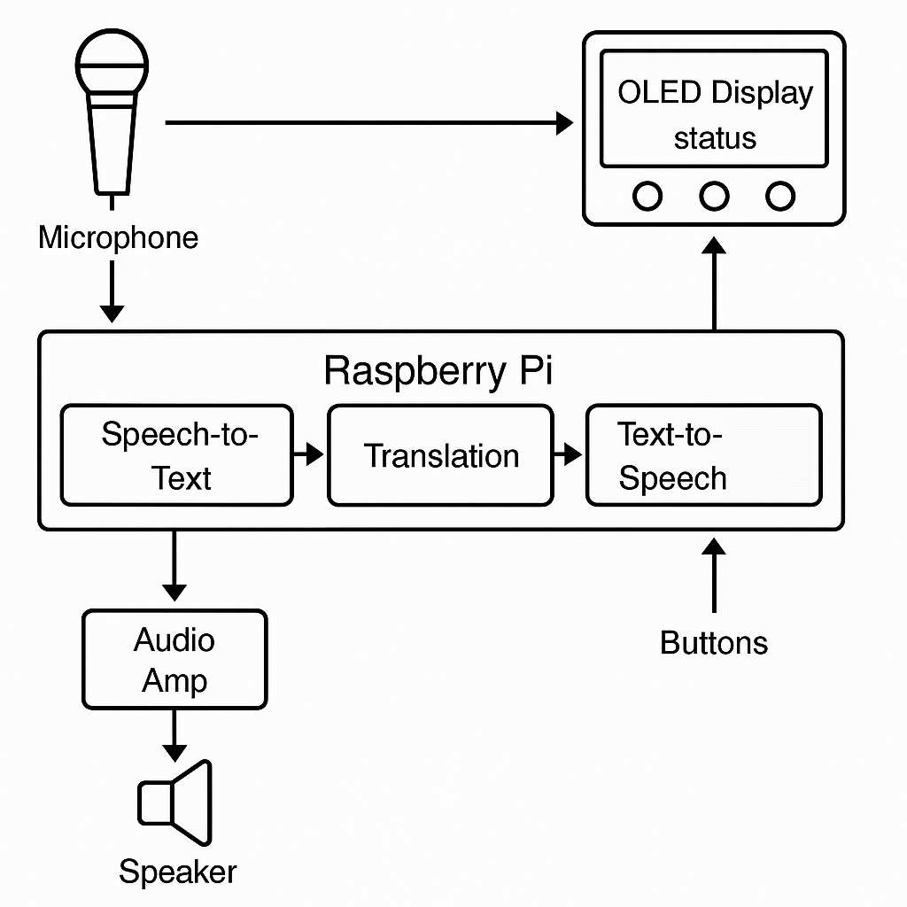

# Portable Bilingual Translator

## Introduction

This project implements a **real-time bilingual voice translator** using a Raspberry Pi Zero 2 W. It captures spoken input via a USB microphone, uses the **SpeechRecognition** library to convert speech to text, translates the text with Google’s translation API (via the **googletrans** Python library), and outputs speech in the target language using Google Text-To-Speech (**gTTS**). For example, a similar Raspberry Pi translator design used gTTS to support multiple languages. The software is written in Python and leverages open-source libraries (`speech_recognition`, `googletrans`, `gTTS`, `RPi.GPIO`, etc.).

---

## Features

* **Voice-to-Voice Translation:** Recognizes speech in one language and plays translated speech in another (realtime).
* **Multilingual:** Supports many languages via the Google Translate API (language codes passed to `Translator` in googletrans).
* **User Interface:** Three buttons (Source, Target, Action) let the user select source/target languages and trigger translation; a 128×64 OLED displays current language codes and status.
* **Audio Output:** Stereo sound via Pi GPIO PWM pins through a PAM8403 amplifier (no soundcard or DAC needed).
* **Portable:** Runs on the Pi Zero 2 W, can be powered by a 5V USB battery pack, and is suitable for a handheld device.
* **Open-Source:** Built in Python with standard libraries (`speech_recognition`, `googletrans`, `gTTS`, `RPi.GPIO`, etc.).

---

## Bill of Materials

| Component                     | Quantity | Description                         |
| ----------------------------- | -------- | ----------------------------------- |
| Raspberry Pi Zero 2 W         | 1        | (with OS on microSD card)           |
| MicroSD card (16GB or higher) | 1        | (for Raspbian OS)                   |
| USB Microphone                | 1        | (for speech input)                  |
| 128×64 OLED display (I2C)     | 1        | (SSD1306-based, for feedback)       |
| PAM8403 audio amplifier       | 1        | (2×3W stereo amp for speakers)      |
| Speaker (4Ω–8Ω)               | 2        | (for audio output)                  |
| Pushbutton switches           | 3        | (for source/target/action controls) |
| Jumper wires and resistors    | —        | (for wiring buttons, OLED, etc.)    |
| 5V power supply or battery    | 1        | (USB adapter or battery pack)       |

---
## Block Diagram



## Wiring Diagram

*(Placeholder for wiring diagram image)*

Refer to datasheets and Pi pinouts for exact wiring.  Key connections include:

* **OLED display:** Connect VCC, GND, SDA, SCL to the Pi’s 3.3V, GND, SDA, SCL pins, respectively.
* **Buttons:** Wire each button to a GPIO pin and ground (or 3.3V) with appropriate pull-ups/pull-downs configured.
* **USB mic:** Plug into a USB port.
* **PAM8403 amplifier:** Wire the left/right PWM outputs (GPIO18, GPIO13) to the PAM8403 inputs, and connect the speakers to the amplifier outputs.

(Add an actual wiring diagram image here when available.)

---
Great, I’ll generate a GPIO connection table specifically for your Raspberry Pi Zero 2 W translator project. It will include connections for the OLED display, buttons, and the PAM8403 amplifier.

I’ll let you know when it’s ready.


## GPIO Pin Connections

The table below lists each peripheral and its GPIO connections on the Raspberry Pi Zero 2 W for the bilingual translator project.  Each row shows the component and signal, the Broadcom GPIO number, the physical pin, and notes (such as I2C or pull-up requirements).

| Component                          | Function/Purpose                 | BCM GPIO | Physical Pin | Notes                                            |
| ---------------------------------- | -------------------------------- | -------- | ------------ | ------------------------------------------------ |
| **OLED Display (SSD1306) – SDA**   | I2C SDA (serial data)            | 2        | 3            | I2C data line (SDA1), with internal pull-up      |
| **OLED Display (SSD1306) – SCL**   | I2C SCL (serial clock)           | 3        | 5            | I2C clock line (SCL1), with internal pull-up     |
| **OLED Display (SSD1306) – VCC**   | 3.3V power supply                | –        | 1            | +3.3V power (do **not** use 5V)                  |
| **OLED Display (SSD1306) – GND**   | Ground                           | –        | 14           | Ground (GND)                                     |
| **Button (Source Language)**       | GPIO input (select source lang.) | 17       | 11           | Button to GND; use internal pull-up (active LOW) |
| **Button (Target Language)**       | GPIO input (select target lang.) | 27       | 13           | Button to GND; use internal pull-up (active LOW) |
| **Button (Translate)**             | GPIO input (start translation)   | 22       | 15           | Button to GND; use internal pull-up (active LOW) |
| **PAM8403 Amp (Left channel IN)**  | PWM audio output (left channel)  | 13       | 33           | PWM1 (audio left) (set GPIO13 to ALT0)           |
| **PAM8403 Amp (Right channel IN)** | PWM audio output (right channel) | 18       | 12           | PWM0 (audio right) (set GPIO18 to ALT5)          |
| **PAM8403 Amp – VCC (+5V)**        | Power +5V                        | –        | 2 (or 4)     | +5V power to amplifier (from Pi 5V rail)         |
| **PAM8403 Amp – GND**              | Ground                           | –        | 6 (or 9)     | Ground (common)                                  |

* *OLED I2C:*  The SSD1306 OLED uses the Pi’s I2C1 bus on GPIO2 (SDA) and GPIO3 (SCL). These pins have internal 1.8 kΩ pull-up resistors, so no external pull-ups are needed. Use 3.3 V (pin 1) for VCC and any GND pin (e.g. pin 14) for ground.
* *Buttons:*  Each tactile button connects from a GPIO to GND, configured as an **active-low** input with the Pi’s internal pull-up enabled.  For example, GPIO17 (pin 11) can be tied to one side of the “Source” button, the other side to GND, and similarly for the “Target” (GPIO27) and “Translate” (GPIO22) buttons.
* *Audio Amplifier:*  The PAM8403 stereo amplifier’s inputs are driven by the Pi’s PWM audio outputs.  Route the left channel (PWM1) to BCM13 (pin 33) and the right channel (PWM0) to BCM18 (pin 12).  In software, set GPIO13 to ALT0 (PWM1) and GPIO18 to ALT5 (PWM0) to enable PWM audio.  Provide the amplifier with +5V (e.g. pin 2) and GND (e.g. pin 6) from the Pi.

All GPIO pin numbers above use **BCM** numbering.  (Physical pin numbers are the standard Pi header positions.)  Ensure I2C is enabled in `raspi-config` and PWM audio is routed correctly for sound output.

**References:** Standard Pi pinout and connection guides used for mapping signals to GPIO.


## Setup Instructions

### System Packages

Update the package list and install system dependencies:

```bash
sudo apt-get update
sudo apt-get install -y python3 python3-pip python3-dev python3-rpi.gpio i2c-tools python3-smbus
```

Also install audio and I2C support libraries:

```bash
sudo apt-get install -y portaudio19-dev libatlas-base-dev alsa-utils python3-pyaudio
```

The `python3-pyaudio` package provides microphone support. Enable the I2C interface (needed for the OLED) with `sudo raspi-config` (Interface Options → I2C) or by adding `dtparam=i2c_arm=on` to `/boot/config.txt` and rebooting.

### Python Packages

Install the required Python libraries using pip:

```bash
pip3 install SpeechRecognition googletrans gTTS RPi.GPIO
```

This installs the speech recognition, translation, and TTS libraries. Also install the OLED driver:

```bash
pip3 install Adafruit-SSD1306
```

This provides the SSD1306 display library.

### Configuration

To use PWM audio on the Pi Zero 2 W, add the following lines to `/boot/config.txt`:

```
dtoverlay=pwm-2chan,pin=18,func=2,pin2=13,func2=4
dtparam=i2c_arm=on
```

This remaps PWM0 to GPIO18 and PWM1 to GPIO13, and enables I2C. Save the file and reboot for changes to take effect.

---

## Audio via GPIO

&#x20;*Figure: Example small USB-powered speakers (driven by the PAM8403 amplifier).*

The Pi Zero 2 W uses its PWM-capable GPIO pins for audio output.  GPIO18 (ALT5) is used as PWM0 (left channel) and GPIO13 (ALT0) as PWM1 (right channel). Wire GPIO18 → left amp input, GPIO13 → right amp input, and connect speakers to the PAM8403 outputs. With the `dtoverlay` set, the Pi will output stereo sound over PWM. Test the setup by playing a stereo audio file or using:

```bash
speaker-test -t wav -c2
```

You should hear the test tone from both speakers.

---

## Usage

1. **Boot Up:** Power on the Pi; the translator program can start automatically (see next section) or run manually via `python3 translator.py`.
2. **Select Languages:** Press **Source** to cycle through input languages (shown on OLED) and **Target** to choose the output language.
3. **Translate:** Press **Action**. The device will begin listening (indicator on OLED or LED). Speak your phrase clearly into the microphone.
4. **Result:** The OLED will display the recognized text and then the translated text, and the translated speech will be played through the speakers.
5. **Repeat:** After playback, you can press **Action** again for another phrase.

The process can be repeated indefinitely. Use `Ctrl+C` or a shutdown command to stop the program if needed.

---

## Auto-Start (systemd)

To run the translator automatically at boot, create a systemd service. For example, create `/etc/systemd/system/translator.service` with:

```ini
[Unit]
Description=Portable Bilingual Translator Service
After=network.target

[Service]
ExecStart=/usr/bin/python3 /home/pi/translator.py
WorkingDirectory=/home/pi
StandardOutput=inherit
StandardError=inherit
Restart=always
User=pi

[Install]
WantedBy=multi-user.target
```

Adjust paths as needed. Then enable and start the service:

```bash
sudo systemctl daemon-reload
sudo systemctl enable translator.service
sudo systemctl start translator.service
```

The translator program will now start on boot and restart if it crashes.

---

## Troubleshooting

* **No Audio Output:** Verify the `/boot/config.txt` overlay line and reboot. Use `aplay -l` to check audio devices and `alsamixer` to adjust volume. Check that speakers are powered and properly connected to the PAM8403 inputs/outputs.
* **Microphone Not Working:** Run `arecord -l` to list capture devices. Ensure the USB mic appears. Test recording: `arecord -D plughw:1 test.wav`. If using ALSA indices, you may need to adjust the microphone index in code.
* **Speech Recognition Errors:** Ensure `PyAudio` is installed (as above). If ambient noise is high, adjust the recognizer’s energy threshold or add `recognizer.adjust_for_ambient_noise()`.
* **Translation Errors:** Both `googletrans` and `gTTS` require Internet access since they call Google’s services. Make sure the Pi is online. Rate limits may cause intermittent failures; try again later if needed.
* **OLED Display Blank:** Confirm I2C is enabled (`sudo raspi-config` or check `/boot/config.txt`). Use `i2cdetect -y 1` to see if the display’s address (usually 0x3C) is detected. Verify SDA/SCL wiring and power.
* **Buttons Unresponsive:** Check the GPIO numbering mode in the code (BCM vs BOARD) and ensure the correct pins are used. Verify that pull-up or pull-down resistors are enabled (either via software or with physical resistors).
* **Library Import Errors:** If Python reports missing modules, re-run `pip3 install` for the missing library. Make sure the script is run with Python 3 (`python3` not `python`).

---

This project is licensed under the MIT License (see `LICENSE` file).
## License

This project is licensed under the MIT License. See the [LICENSE](LICENSE) file for details.


## Credits

This device was developed as a final-year engineering project. It draws on ideas from similar Raspberry Pi translator projects and tutorials.
****
