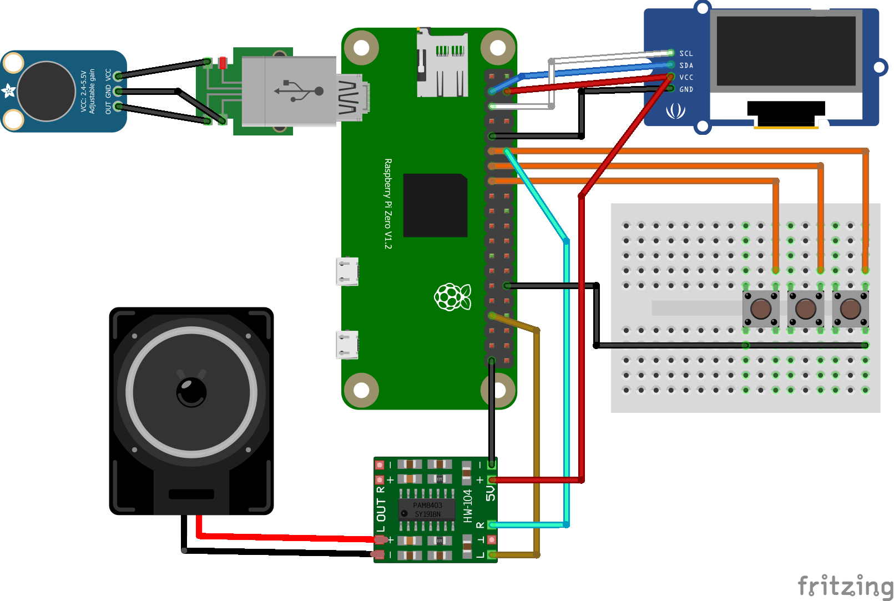

Thanks! I’ll write a professional and well-structured README.md file for your GitHub project titled 'Portable Bilingual Language Translator Using Raspberry Pi Zero'. It will include project overview, features, hardware list, setup instructions, wiring diagrams, usage, and license info, written in a clear and developer-friendly style suitable for open-source sharing or academic submission.

I’ll let you know as soon as it’s ready.


# Portable Bilingual Language Translator Using Raspberry Pi Zero

A compact, real-time bilingual translator built on the Raspberry Pi Zero platform. This device listens to spoken input in one language, converts it to text (speech-to-text), translates it using the Google Translate API, and then vocalizes the result via text-to-speech in the target language.  It features a 128×64 OLED display for prompts and feedback, push buttons to select source/target languages, and a PAM8403 amplifier with a small speaker for audio output. By combining open-source speech-recognition and translation libraries, it enables conversation across languages on a \$35 “\$mini-computer”.

## Features

* **Real-time Speech Recognition (STT):** Captures spoken input with a microphone and converts it to text using Python libraries (e.g. `SpeechRecognition`).
* **Multi-language Support:** Selectable source and target languages. Supports many Indian and international languages via Google Translate/gTTS.
* **Instant Translation:** Uses the Google Translate API (`googletrans` Python library) to translate recognized text between chosen languages.
* **Text-to-Speech (TTS) Output:** Reads out translations using Google Text-to-Speech (`gtts` package), producing a clear voice in the target language.
* **OLED Feedback:** The 128×64 OLED (I2C SSD1306) display shows prompts, status messages, and the transcribed/translated text.
* **Button Interface:** Push-buttons let the user toggle translation direction or trigger recording. (e.g. one button for “EN→HI”, another for “HI→EN” as an example).
* **Portable Design:** Low-power Pi Zero hardware and compact components make it easy to carry; ideal for on-the-go language assistance.

## Hardware Used

* **Raspberry Pi Zero 2 W** – Compact single-board computer (Wi-Fi/BT, eMMC optional).
* **USB Microphone** – For voice input (e.g. a small plug-in USB mic).
* **Speaker** – Mini 8Ω, 3W speaker.
* **PAM8403 3W Amplifier Module** – Drives the speaker from the Pi’s audio output.
* **128×64 OLED Display (SSD1306)** – Monochrome OLED for status; connects via I2C (SDA, SCL).
* **Push-Buttons (momentary switches)** – E.g. two buttons to select language pair or control recording.
* **Miscellaneous Electronics:** Resistors (e.g. 10KΩ pull-ups for buttons), capacitors for noise filtering, jumper wires, breadboard or protoboard, etc.
* **Power Supply:** 5V/2A DC adapter or battery pack (to power Pi and amplifier).
* **(Optional) USB Sound Card:** Since Pi Zero lacks analog audio out, a USB audio dongle can provide line out if not using GPIO audio.

*Example Bill of Materials (from similar projects): Raspberry Pi Zero, display, PAM8403 module, switches, resistors, capacitors, 5V adapter, speaker, USB microphone, etc.*

## Circuit Diagram and Block Diagram

The diagrams below illustrate the hardware connections and system architecture:


*Circuit diagram: Interconnections between the Raspberry Pi Zero, microphone (USB), OLED display, push-buttons, PAM8403 amplifier, and speaker.*


*Block diagram: Functional flow – speech input → STT → translation → TTS output.*

Refer to **`circuit_diagram.png`** and **`block_diagram.png`** in the repo for detailed schematics.

## System Wiring and GPIO Mapping

* **Display (OLED):** Connect the OLED module to the Pi’s I²C pins: SDA → GPIO2 (pin 3), SCL → GPIO3 (pin 5). Power it from 3.3V and GND.
* **Buttons:** Wire one side of each push-button to a GPIO input pin and the other side to GND (use internal pull-ups or 10KΩ resistors to 3.3V). For example, connect Button 1 to GPIO17 for *“EN→HI”* mode and Button 2 to GPIO22 for *“HI→EN”* (as in the Elektor project). Pressing a button can signal the code which language pair to use.
* **Microphone:** Plug the USB microphone into a USB port. The Pi will recognize it as an audio input (requires `pyaudio` or similar library).
* **Audio Output:** Pi Zero has no built-in audio jack. You can enable audio on GPIO using the **`audremap`** overlay (e.g. add `dtoverlay=audremap,pins_18_13` to `/boot/config.txt` to send audio to GPIO 18/13 pins). A better approach is to use a cheap USB sound card with 3.5mm jack. Connect the amplifier’s input (L/R) to the Pi’s audio output (GPIO pins or USB DAC). Power the PAM8403 amplifier from 5V and GND. Connect the speaker to the amplifier outputs.
* **Power:** Provide 5V (from the supply) to the Pi’s 5V pin and to the amplifier’s VCC. Share grounds between all modules.

*Note:* In the Elektor design, a metal heatsink and slight overclock (1.3 GHz) were used on the Pi Zero to handle the workload, and a stable internet connection was required. Using a Wi-Fi-enabled Pi Zero (2W) or a USB Wi-Fi dongle is necessary for online translation.

## Installation and Setup

1. **Prepare the OS:** Flash Raspberry Pi OS (32-bit) onto a microSD card and boot the Pi Zero. Enable **I²C** (for the OLED) via `raspi-config` (Interfacing Options → I2C) and reboot. Ensure Wi-Fi is set up (if using Pi Zero W).
2. **Install system packages:**

   ```bash
   sudo apt-get update
   sudo apt-get install python3-pip python3-dev portaudio19-dev i2c-tools
   ```

   * *`portaudio19-dev`* is needed for audio (`pyaudio`).
   * Ensure Python 3.7+ is available.
3. **Enable audio (if using GPIO pins):** Edit `/boot/config.txt` and add:

   ```conf
   dtoverlay=audremap,pins_18_13
   dtparam=i2c_arm=on
   ```

   Then reboot. This routes audio to GPIO18/13 (which feed into the PAM8403 via a headphone jack).
4. **Install Python libraries:**

   ```bash
   pip3 install --upgrade pip
   pip3 install SpeechRecognition gtts googletrans==4.0.0-rc1 RPi.GPIO Adafruit-SSD1306 pillow pyaudio
   ```

   * `SpeechRecognition` (for STT), `gtts` (for TTS), `googletrans` (for translation).
   * `Adafruit-SSD1306` for the OLED display; `pillow` for image fonts.
   * `pyaudio` for USB microphone support (already installed via `portaudio19-dev`).
5. **Clone this repository:**

   ```bash
   git clone https://github.com/YourUsername/Portable-Bilingual-Translator.git
   cd Portable-Bilingual-Translator
   ```
6. **Configure language codes:** Edit any config file or the code to set default source/target language codes (e.g. `en`, `hi`, `bn`, etc.). Ensure Google Translate API or `googletrans` can access these codes.
7. **Test components:** Verify the microphone, speaker, and display work (you can run small tests: record audio, play sound, show text on OLED).

## How to Use

1. **Start the program:** Run the main Python script (e.g. `python3 translator.py`). The OLED will prompt for language selection.
2. **Select language mode:** Press the appropriate button for your translation direction (e.g. press the “EN→HI” button to translate English to Hindi). The display should confirm the mode (e.g. *“Mode: English → Hindi”*).
3. **Record speech:** When ready, **press and hold** (or press once to start, then again to end) the same button and speak a short phrase clearly into the microphone. The OLED will display status messages (e.g. *“Recording…”*).
4. **Process:** Release (or press again) to stop recording. The system will display *“Transcribing…”*, then *“Translating…”*. It uses speech recognition to get the text, translates it via Google, and then prepares speech. This may take a few seconds.
5. **Output:** The translated phrase is then spoken through the speaker (powered by the PAM8403 amp). For example, an English sentence will be played as Hindi audio. The OLED shows the translated text. Press the other button (e.g. “HI→EN”) to do the reverse direction.

In practice, you might see instructions like *“Press EN→HI”*, *“Speak now”*, *“Converting…”*, etc., on the display as feedback. This workflow follows the design where each button press initiates recording in one language and outputs the translation in the other.

## Screenshots or Demo (optional)

*(Here you could add example screenshots of the OLED display or photos of the assembled device.)*

For example, a photo might show the OLED showing *“Recording (EN→HI)”*, and a recording of spoken English being processed into Hindi speech.  *(Note: Insert `screenshot.png` or a demo GIF in the repo if available.)*

## Credits

Developed by \[Your Name] for Final Year Project, Jan 2025.

## License

This project is released under the MIT License. See the [LICENSE](LICENSE) file for details.
